# ⚡ Detecting Anomalies in Real-Time with AWS ML & Data Streams

This repository presents a real-time anomaly detection system built using core **AWS**, services following a standard cloud-native architecture. It supports continuous ingestion of streaming data, real-time inference through a machine learning model, and automated anomaly detection and flagging.

## 🚀 Features

- Real-time data ingestion using **Amazon Kinesis Data Streams**.
- Machine learning–based anomaly detection via **SageMaker endpoints**.
- Scalable, serverless data processing pipeline.
- Event-driven execution powered by **AWS Lambda**.

## 🔍 Use Cases

- IoT sensor anomaly monitoring
- Real-time fraud detection
- Application log outlier analysis
- System health and intrusion detection

## ⚙️ Synthetic Dataset Generator for Anomaly Detection Tasks

In statistics, an **anomaly** refers to a data point that deviates significantly from the overall pattern or distribution of a dataset also known as **Outlier**. It is an observation that lies at an unusual distance from other values in a random sample, indicating it may not conform to expected behavior.

**Example:**  
A temperature sensor in a cold storage facility typically records values between **2°C and 6°C**. Suddenly, it records **23°C** — a sharp and unexpected spike.  
This unusual reading is an **outlier** (or anomaly) and could indicate a sensor fault, equipment failure, or a door left open.

Here, we'll simulate such data through random generation.

```
import random
import pandas as pd
import numpy as np
import matplotlib.pyplot as plt

def generate_trending_data_with_anomalies(n_rows=1000, n_features=5, n_anomalies=10, trend_type='linear', seed=100):
    np.random.seed(seed)
    random.seed(seed)

    time_index = pd.date_range(start='2020-01-01', periods=n_rows, freq='T')
    data = pd.DataFrame(index=time_index)
    labels = pd.DataFrame(0, index=time_index, columns=[f'feature_{i+1}' for i in range(n_features)])

    for i in range(n_features):
        base = np.zeros(n_rows)

        if trend_type == 'linear':
            base = np.linspace(0, 100 + i * 20, n_rows) + np.random.normal(0, 5, n_rows)
        elif trend_type == 'random_walk':
            base = np.cumsum(np.random.normal(loc=0.1, scale=1, size=n_rows))
        elif trend_type == 'exponential':
            base = np.exp(np.linspace(0, 5 + i, n_rows)) + np.random.normal(0, 100, n_rows)
        else:
            raise ValueError("Unsupported trend_type. Use 'linear', 'random_walk', or 'exponential'.")

        # Inject anomalies
        anomaly_indices = np.random.choice(n_rows, n_anomalies, replace=False)
        base[anomaly_indices] += np.random.choice([-1, 1], n_anomalies) * np.random.uniform(50, 200, n_anomalies)
        labels.iloc[anomaly_indices, i] = 1  # Mark anomalies

        data[f'feature_{i+1}'] = base

    return data, labels
```

```
# Creating Train Dataset
train_data, train_labels = generate_trending_data_with_anomalies(
   n_rows=10000,
   n_features=5,
   n_anomalies=500,
   trend_type='linear'
)

# Creating Test dataset
test_data, test_labels = generate_trending_data_with_anomalies(
   n_rows=10000,
   n_features=5,
   n_anomalies=500,
   trend_type='linear'
)
```

<p float="left">
  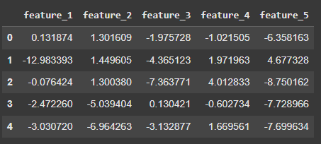
  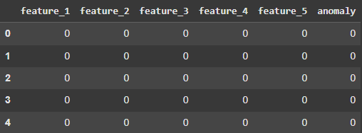
</p>
<!--   -->

The dataset (Image 1) is created by randomly generating rows of normal values between 0.0 and 1.0. For each row, there's a 5% chance it will be marked as an anomaly, meaning one or more values in that row will be randomly replaced with a number between 4.0 and 10.0.

The labels (Image 2) include a column for each feature, marking whether each value is normal (0) or anomalous (1). The training label set also includes an extra column called "anomaly", which is set to 1 if any value in that row is anomalous, and 0 if all values are normal.

Now that our dataset includes anomalies, we can train an anomaly detection model on it. This model will help us identify anomalies in new, unseen data.

## 📈 Plotting Data Trends and Anomalies

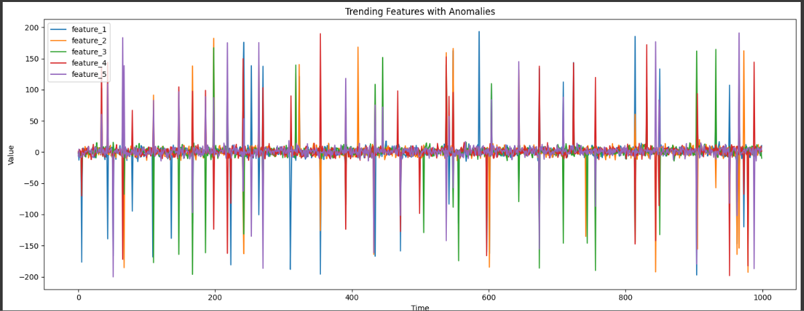

## 🧠 Training a Model to Detect Anomalies

For this task, we'll use the Isolation Forest algorithm for unsupervised anomaly detection. It's a widely used method known for its efficiency in detecting anomalies in large datasets without the need for labeled data during training. Isolation Forest also works well with high-dimensional data and requires minimal parameter tuning.

```
from sklearn.ensemble import IsolationForest
from sklearn.metrics import precision_score, recall_score
```

The `sklearn` Python library provides a built-in implementation of the **Isolation Forest** algorithm, which we can use to train our anomaly detection model.  
The code below demonstrates how to train your own Isolation Forest model using `sklearn`'s `IsolationForest` class.

```
import joblib

# fit the model to the training data
model = IsolationForest(contamination='auto', random_state=42, bootstrap=True)
model.fit(train_data)

# run anomaly detection on the testing data
predictions = model.predict(test_data)

# Evaluate Model: Calculate precision and recall
precision = precision_score(ground_truth, predictions)
recall = recall_score(ground_truth, predictions)

# Print the results
print(f'Precision: {precision:.2f}')
print(f'Recall: {recall:.2f}')

# Save the model to a .pkl file
joblib.dump(model, 'models/anamoly_detection_forest_model.pkl')
```

```
Precision: 0.99
Recall: 1.00
```

The code trains the Isolation Forest model using the training dataset, evaluates its performance on the test data, and then saves the model as a `.pkl` file. This saved model will later be used to detect anomalies in a Kinesis data stream that we'll configure.

## 🐳 Pushing Your Inference Code to AWS Elastic Container Registry

Now that the model has been trained and saved, we can deploy it to the cloud using **AWS SageMaker**.  
A common and effective way to deploy a custom-trained model on AWS is by containerizing the inference code using **Docker** and storing the image in **Amazon Elastic Container Registry (ECR)**.  
Once the image is in ECR, **SageMaker** can pull it directly for deployment.

Below is the project structure of the inference code we'll be deploying to SageMaker:

```
├── Dockerfile
├── app.py
├── requirements.txt
└── src
    ├── inference.py
    └── model
        └── anamoly_detection_forest_model.pkl
```

### Dockerfile

The `./Dockerfile` is a script that defines how to build a Docker image.  
Docker images are lightweight, portable, and self-contained packages that include everything needed to run an application—such as the code, runtime, libraries, and dependencies.  
The Dockerfile contains step-by-step instructions that Docker uses to automatically create this image.

```
FROM python:3.10.4

WORKDIR /app

COPY requirements.txt .
RUN pip3 install --no-cache-dir -r requirements.txt

COPY . .

ENTRYPOINT ["gunicorn", "-b", "0.0.0.0:8080", "app:app", "-n"]
```

### app.py

The `app.py` file defines a Flask web application that acts as the inference endpoint for a machine learning model.

It includes two endpoints required by SageMaker:

- **`/ping`** – Used by SageMaker to perform health checks and ensure the endpoint is running.
- **`/invocations`** – Handles incoming prediction requests by calling the `predict` function and returning the anomaly detection results in the response.

```
import os
import logging
import joblib
from flask import Flask, request
from werkzeug.middleware.proxy_fix import ProxyFix
from src.inference import predict

logging.basicConfig(level=logging.INFO)
logger = logging.getLogger(__name__)

app = Flask(__name__)
app.wsgi_app = ProxyFix(app.wsgi_app, x_for=1, x_proto=1, x_host=1, x_prefix=1)

model_path = os.environ.get("MODEL_PATH", "./src/model/anamoly_detection_forest_model.pkl")
try:
    model = joblib.load(model_path)
except Exception as e:
    logger.error(f"Error loading model: {e}")
    model = None

@app.before_request
def enforce_json():
    if request.method == "POST" and not request.is_json:
        return {"error": "Content-Type must be application/json"}, 415

@app.route("/ping", methods=["GET"])
def ping():
    return "pong", 200

@app.route("/invocations", methods=["POST"])
def invocations():
    if not model:
        return {"error": "Model not loaded"}, 500

    body = request.get_json()
    if not body:
        return {"error": "Invalid JSON input"}, 400

    try:
        prediction = predict(body=body, model=model)
        return prediction
    except Exception as e:
        logger.exception("Prediction failed")
        return {"error": str(e)}, 500
```

### src/inference.py

```
import pandas as pd

def predict(body: dict, model) -> dict:
    """
    Use the trained model to make predictions on the received data.
    """
    data = pd.DataFrame(body)
    predictions = model.predict(data).tolist()
    return {"predictions": predictions}
```

##### ./src/model/anamoly_detection_forest_model.pkl

Make sure to place your trained model file (anamoly_detection_forest_model.pkl) inside the ./src/model/ directory so it can be loaded directly when the Docker image is built.

## Dpeloy Your Docker Inference Image to AWS Elastic Container Registry (ECR)

The next step is to build a Docker image that contains our inference code and push it to Amazon Elastic Container Registry (ECR).

Amazon ECR is a fully managed container registry service from AWS that lets you store, manage, and deploy Docker container images.

We'll begin by building our Docker image locally.

##### Build docker image

```
docker build -t anamoly_detection_data_inference .
```

After running docker images, you'll see a list of your locally available Docker images along with their image IDs.
Make a note of the image ID for your newly created image, as you'll need it when pushing the image to AWS ECR.

Next, use the AWS CLI and Docker CLI to authenticate and log in to your Amazon Elastic Container Registry (ECR) by running the following command:

```
aws ecr get-login-password --region <region>| docker login --username AWS --password-stdin <aws-account>.dkr.ecr.<region>.amazonaws.com
```

replace placeholder <region> and <aws-account> with your own information.

The following command retags your Docker image to match the naming format required by Amazon ECR.
Be sure to replace <image-id>, <aws-account>, <region>, and <container-registry-name> with your actual values.

```
docker tag <image-id> <aws-account>.dkr.ecr.<region>.amazonaws.com/<container-registry-name>:synthetic_data_inference

```

Finally, you can push your inference Docker image to Amazon ECR using the command below.
Make sure to replace the placeholders with your own details before running it.

```
docker push <aws-account>.dkr.ecr.<region>.amazonaws.com/<container-registry-name>:synthetic_data_inference
```

You can now verify that your image has been successfully pushed by navigating to the AWS Console:
Go to **Amazon ECR** → **Repositories** → **your-repository**, where you should see your uploaded image.

## 🚀 Deploying a Custom Model and Endpoint with Amazon SageMaker

##### Configuring a SageMaker Model

Go to SageMaker -> Models and click Create model.

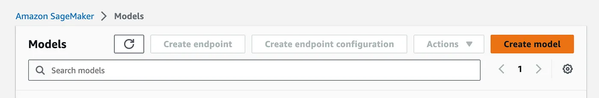

Create the model by providing the location of your inference image stored in Amazon ECR.

Since the trained model is already bundled within the Docker image, there's no need to separately specify the model artifact location.

On the next screen, complete the Model Settings and Container Definition sections, then click Create model to proceed.

##### Configuring a Model Endpoint

In **Amazon SageMaker**, an endpoint is a URL that allows your deployed machine learning model to be accessed by other applications or systems for real-time inference.

To begin setting up your endpoint, navigate to **SageMaker** → **Endpoints**, then click **Create endpoint**.

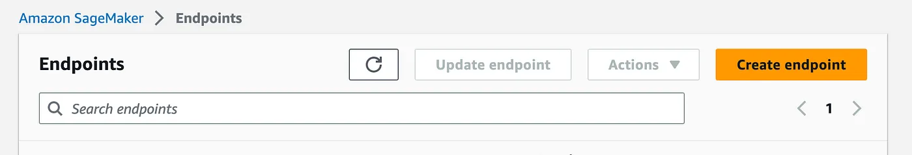

The next step is to set up a live data stream that will allow us to perform real-time anomaly detection using our deployed machine learning model.

# 🔄 Streaming Real-Time Data Using Amazon Kinesis

For this demonstration, we’ll simulate a real-time data stream by writing a Python function that sends a new batch of records to a Kinesis stream every second.

In real-world applications, streaming data would typically come from live sources such as event logs, network traffic, IoT sensor data, or customer transactions, among others.

## Creating a Kinesis Data Stream

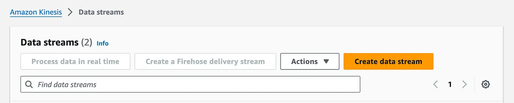

## 📤 Feeding Data into the Kinesis Stream

The code below reads batches of 10 rows from the test dataset CSV file and sends each batch to the Kinesis stream at 1-second intervals, simulating real-time data streaming.

```
import csv
import boto3
import time

def read_csv_batches(file_path, batch_size=10):
    # Read CSV file in batches of 10 rows
    with open(file_path, 'r') as csvfile:
        reader = csv.reader(csvfile)
        batch = []
        for row in reader:
            batch.append(row)
            if len(batch) == batch_size:
                yield batch
                batch = []
        if batch:
            yield batch

def send_to_kinesis(kinesis_client, stream_name, records):
    # Send data to Kinesis stream
    records = [{'Data': ','.join(record)} for record in records]
    response = kinesis_client.put_records(StreamName=stream_name, Records=records)
    return response

def main():
    # Set your AWS credentials and region
    aws_access_key_id = 'YOUR_ACCESS_KEY_ID'
    aws_secret_access_key = 'YOUR_SECRET_ACCESS_KEY'
    aws_region = 'YOUR_AWS_REGION'

    # Set your Kinesis stream name
    stream_name = 'YOUR_KINESIS_STREAM_NAME'

    # Create a Kinesis client
    kinesis_client = boto3.client('kinesis', aws_access_key_id=aws_access_key_id, aws_secret_access_key=aws_secret_access_key, region_name=aws_region)

    # Set the path to test data CSV file
    csv_file_path = 'path/to/your/file.csv'

    # Read batches of 10 lines and send to Kinesis every second
    for batch in read_csv_batches(csv_file_path):
        send_to_kinesis(kinesis_client, stream_name, batch)
        time.sleep(1)

if __name__ == "__main__":
    main()
```

Make sure to update lines 26–28 in the script with your AWS account details, and replace line 31 with your actual Kinesis stream name.
Also, ensure that csv_file_path on line 37 points to the test dataset you previously generated.

Once you've configured the test CSV file, AWS credentials, and stream name, you can run the script locally using:

```
python3 stream_writer.py
```

You should now have a live Kinesis data stream continuously sending batches of 10 anomaly test records every second.

# 🔗 Connecting Streaming Data to a Model Endpoint Using AWS Lambda

The final step is to connect all the components using an AWS Lambda function.
Lambda is a serverless compute service from AWS that lets you run small, single-purpose functions without managing any servers. These functions are triggered by specific events (like new data in a Kinesis stream) and automatically scale based on demand.

To create an **AWS Lambda function**, navigate to **AWS Lambda** → **Functions** in the AWS Management Console, then click **“Create function”**.

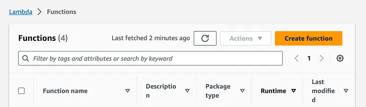

select Author from scratch, name your Lambda function, select the Python runtime, and click Create function.

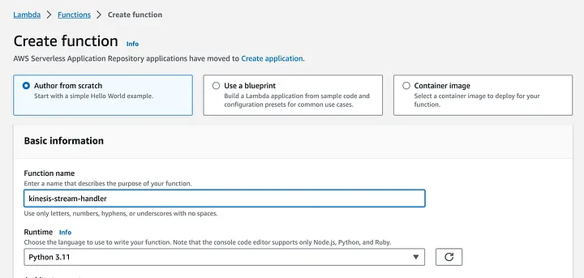

Below is the code for our Lambda function, which should be placed in **lambda_function.py**.
This function listens for new records from the Kinesis data stream and sends them to the **model endpoint** for real-time **anomaly detection**.

```
import json
import boto3
import base64

def lambda_handler(event, context):
    """
    This Lambda function is triggered by new records in a Kinesis stream.
    It decodes the records, sends them to a SageMaker endpoint,
    and logs the anomaly detection results.
    """

    # Create SageMaker runtime client
    sagemaker_runtime = boto3.client('sagemaker-runtime')
    endpoint_name = 'synthetic-dataset-anomaly-detection-endpoint'

    print('Processing event:', json.dumps(event))

    payload = []

    # Process each Kinesis record
    for record in event['Records']:
        try:
            # Decode base64-encoded Kinesis data
            raw_data = base64.b64decode(record['kinesis']['data']).decode('utf-8')
            if raw_data:
                data = json.loads(raw_data)
                payload.append(data)
                print("Decoded payload:", data)
        except Exception as e:
            print(f"Error processing record: {e}")

    # Send payload to SageMaker endpoint
    if payload:
        try:
            response = sagemaker_runtime.invoke_endpoint(
                EndpointName=endpoint_name,
                ContentType='application/json',
                Body=json.dumps(payload)
            )
            inference_result = json.loads(response['Body'].read().decode('utf-8'))
            print("Inference Result:", inference_result)
            return {'statusCode': 200, 'body': inference_result}
        except Exception as e:
            print(f"Error invoking endpoint: {e}")
            return {'statusCode': 500, 'body': str(e)}
    else:
        # No valid records
        empty_result = {'predictions': []}
        print("No Kinesis records to process:", empty_result)
        return {'statusCode': 200, 'body': empty_result}
```

Copy and paste the above code into a file named lambda_function.py.

On line 11, be sure to update the value of endpoint_name with the actual name of your SageMaker endpoint.

## ⚡ Creating an Event Trigger for the Lambda Function

Next, we’ll configure a trigger for our Lambda function so that it automatically executes whenever a new record is added to the **Kinesis stream**. This allows the function to read and process incoming data in real time.

In the AWS Lambda console, click **“Add trigger”** to begin setting it up.

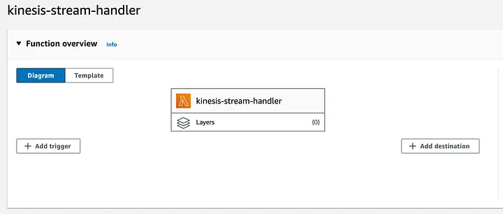

On the next screen, set up the **trigger configuration**:

1. Select **Kinesis** as the trigger source.
2. Choose the **Kinesis stream** you configured earlier.
3. Click **Add** to attach the trigger to your Lambda function.

> ⚠️ **Note**: If you encounter an error at this stage, make sure the **IAM role** associated with your Lambda function has the necessary permissions to access both **Kinesis streams** and the **SageMaker endpoint**.

---

Once the trigger is added, click **Deploy** to launch your Lambda function.  
After deployment, the function will begin **reading real-time data from the Kinesis stream** and **invoking your model endpoint** to perform anomaly detection on each batch of incoming records.

> 🔄 **Important**: Ensure the `stream_writer.py` script is running so that data is actively being pushed into the Kinesis stream.

---

✅ You can verify that your **real-time machine learning pipeline** is functioning correctly by checking the **live logs in Amazon CloudWatch** for your Lambda function.

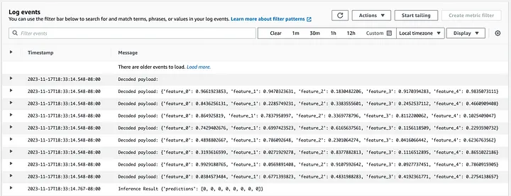

In the **CloudWatch logs**, you should be able to see both the contents of the **real-time streaming data** and the **anomaly predictions** returned by your machine learning model.

# Architecture Diagram

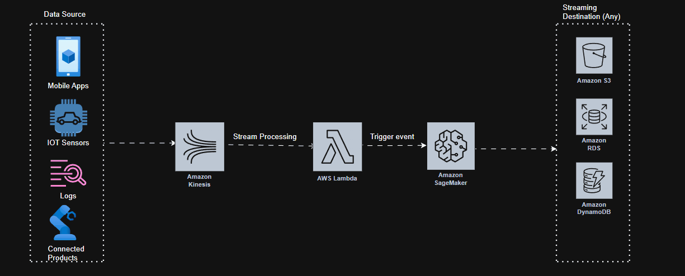

# Conclusion

## 🎉 Wrapping Up

In this blog, we walked step-by-step through the process of deploying a machine learning model on **AWS** for **real-time inference on streaming data**.  
We covered how to:

- 🚢 Deploy a custom model using **Amazon ECR** and **SageMaker**
- 🔄 Stream real-time data with **Amazon Kinesis**
- 🧩 Connect the Kinesis stream to **SageMaker** using **AWS Lambda** for live anomaly detection

---

Thanks for reading! 😊
