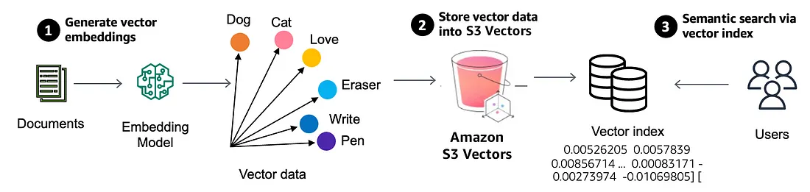
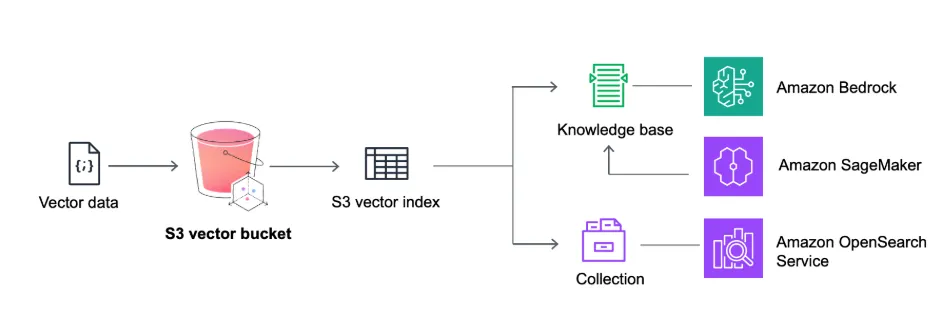

# ⚡ Implementing Semantic Search (Vector Search) Using Amazon S3 Vectors

This article explains how to implement AWS semantic search and Retrieval-Augmented Generation (RAG) with Amazon S3 Vectors. It covers creating vector buckets, generating Bedrock embeddings, storing vectors in S3, and building a serverless similarity search pipeline for AI applications.

Building a Retrieval-Augmented Generation (RAG) pipeline has traditionally required dedicated and often expensive vector databases like **FAISS**, or external managed services such as **Pinecone**. Managing these solutions involves infrastructure setup, scaling, and ongoing maintenance—tasks that can be excessive and costly for many real-world applications, especially at scale.

To address these challenges, Amazon Web Services introduced **[Amazon S3 Vectors](https://aws.amazon.com/s3/features/vectors/)**, the first cloud object store with native vector indexing and similarity search capabilities.


##  AWS S3 Vectors: A Brief Overview

### 🌟 Key Features of Amazon S3 Vectors

- 🪣 **Vector Buckets:** Purpose-built for storing high-dimensional vector data  
- 🗂️  **Automatic Indexing:** Embeddings and metadata are indexed automatically  
- ☁️ **Fully Serverless:** No cluster management or provisioning required  
- 🔎 **Rich Querying:** Supports similarity search with metadata filters  
- 🔗 **Native Integrations:** Easily connects with Bedrock, OpenSearch, and SageMaker  


S3 Vectors is ideal for scalable applications such as document retrieval, semantic search, and multi-modal RAG, particularly where cost efficiency and operational simplicity are important.


## 🔄 Operational Workflow

<a href="./images/s3-vector-architecture.webp" target="_blank">
  
</a>


Amazon S3 Vectors introduces vector buckets, a specialized bucket type designed with dedicated APIs for storing, accessing, and querying vector data. This eliminates the need for infrastructure provisioning. When creating an S3 vector bucket, vector data is organized within vector indexes, simplifying similarity search queries against your dataset. Each vector bucket can support up to 10,000 vector indexes, with each index capable of holding tens of millions of vectors.

After creating a vector index, metadata can be attached as key-value pairs to each vector when adding vector data. This enables filtering future queries based on conditions like dates, categories, or user preferences. S3 Vectors automatically optimizes the vector data as you write, update, and delete vectors, ensuring optimal price-performance for vector storage, even as datasets scale and evolve.

## ✨ Why This Matters

Vector search is revolutionizing several key applications:

- **Retrieval-Augmented Generation (RAG):** 🤖 Enhancing AI responses by incorporating relevant and accurate data.
- **Semantic Search:** 🔍 Enabling the discovery of documents, images, or videos based on meaning, not just keywords.
- **Recommendation Systems:** 💡 Matching users with products, movies, or content they'll genuinely appreciate.

Previously, specialized and costly vector databases were essential. Now, with S3 Vectors, you can store vectors in S3 at a fraction of the cost while achieving sub-second query speeds! 🚀


## 🚀 How to Use S3 Vectors

<a href="./images/how-to-use-s3-vectors.webp" target="_blank">
  
</a>


Here's a step-by-step guide to get you started with Amazon S3 Vectors:

1.  **Create a Vector Bucket:** 🗃️ Use the AWS Management Console, AWS CLI, or SDKs to create a new S3 bucket, specifying it as a vector bucket. 
2.  **Create a Vector Index:** 📍 Define the structure and configuration of your vector index within the bucket in other words specify the vector dimensions and distance metric (Cosine or Euclidean)

**🤖 Generating Embeddings with Amazon Bedrock and Storing them in S3 Vectors**

```
# Generate embeddings with Amazon Titan
response = bedrock.invoke_model(
    modelId='amazon.titan-embed-text-v2:0',
    body=json.dumps({"inputText": "Your text here"})
)
embedding = json.loads(response['body'].read())['embedding']

# Store in S3 Vectors
s3vectors.put_vectors(
    vectorBucketName="my-bucket",
    indexName="my-index",
    vectors=[{"key": "v1", "data": {"float32": embedding}}]
)
```


3.  **Add Vector Data:** ➕ Upload your vector embeddings and associated metadata to the vector index.
4.  **Perform Similarity Searches:** 🔎 Use the S3 Vectors API to execute similarity searches, filtering results using metadata as needed.

```
results = s3vectors.query_vectors(
    vectorBucketName="my-bucket",
    indexName="my-index",
    queryVector={"float32": query_embedding},
    topK=3  # Return top 3 matches
)
```


5. **Integrate with Applications:** 🔗 Connect S3 Vectors with other AWS services like:

    *   Bedrock Knowledge Bases (🧠 Use S3 Vectors as a low-cost vector store for RAG)
    *   SageMaker Unified Studio (💻 Build AI applications with built-in vector storage capabilities)
    *   OpenSearch (🔎 Export vectors to OpenSearch for real-time queries when needed)

    to build complete AI-powered applications.


## 🎯 The Big Picture

This fundamentally changes the economics of AI. Storing vectors affordably means you can:

*   **Keep more historical data:** 🕰️ Retain valuable insights from the past.
*   **Scale to larger datasets:** 📈 Handle massive amounts of information without prohibitive costs.
*   **Experiment more freely:** 🧪 Innovate and explore new possibilities without budget constraints.

If you're involved in AI, this is a pivotal moment where a new tool simplifies everything. It's definitely worth exploring! 🚀


